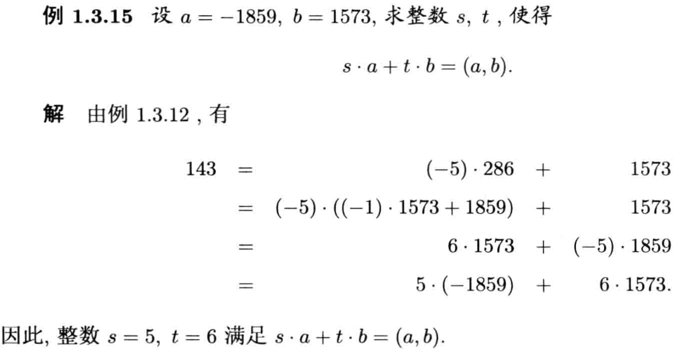

### 整除

若 $a = q \cdot b$，则 $b$ 整除 $a$，记作 $b\ |\ a$ 。比如 $5\ |\ 10$ 

### Eratoshenes 筛法

对任意给定的正整数 $N$ ，要求出所有不超过 $N$ 的素数，列出 $N$ 个整数，从中删除不大于 $\sqrt{N}$ 的所有素数的倍数，将其依次删除，余下的整数就是所要求的不超过 $N$ 的素数。

```go
const N int = 1000000

func Eratoshenes() {
    start := time.Now()
    temp := make([]bool, N+1)
    for i := 2; i <= int(math.Sqrt(float64(N))); i++ {
        if !temp[i] {
            for j := 2 * i; j <= N; j += i {
                temp[j] = true
            }
        }
    }
    t := time.Since(start)
    fmt.Println(t)
}
```

### 欧几里得除法---最小非负余数

$a = q\cdot b + r$ 也就是 $a \% b = r$ 也就是 $q = [\frac{a}{b}], r = a - [\frac{a}{b}]$

素数的平凡判别：对于给定正整数 $N$ ，设不大于 $\sqrt{N}$ 的所有素数为 $p_0, p_1, \cdots , p_s$ ，如果 $N$ 被所有 $p_i$ 除的余数都不为零，则 $N$ 是素数。其实就是筛法的逆向考虑。。

```go
func isPrime(a int) bool {
    for i := 2; i <= math.sqrt(a); i++ {
        if a % i == 0 {
            return false
        }
    }
    return true
}
```

### 最大公因数和广义欧几里得除法

若 $a = q \cdot b + c$，则 $(a, b) = (b, c)$ ，因此我们可以使用欧几里得除法来求最大公因数： $(a, b) = gcd(a, b)$

```go
func gcd(a, b int) int {
    for b != 0 {
        a, b = b, a%b
    }
    return a
}
```

### 贝祖等式

存在 s 和 t 满足 $s \cdot a + t \cdot b = (a, b)$

```go
// 求解 ma + nb = gcd(a, b)
func extendedEuclidean(a, b int) (m, n int) {
    if b == 0 {
        m, n = 1, 0
    } else {
        m, n = extendedEuclidean(b, a%b)
        c := a / b
        m, n = n, m-n*c
    }
    return
}
```



### 素数定理


$$
\displaystyle\lim_{x \rightarrow \infty}\frac{\pi(x)}{\frac{x}{lnx}} = 1
$$


$\pi(x)$ 表示不大于 $x$ 的素数的个数。

### 线性丢番图方程

$ax + by = c$

- 判断有解

  若 $(a, b) | c$，则有解

- 求一个解

  贝祖等式得到 $s$ 和 $t$，则 $x_0 = \frac{c}{(a, b)}s, y_0 = \frac{c}{(a, b)}t$ 。

- 求所有解

  $x = x_0 + \frac{b}{(a, b)}n, y = y_0 - \frac{a}{(a, b)}n$

```go
func main() {
    // 8x + 15y = 2
    a, b, c := 8, 15, 2
    if c%gcd(a, b) != 0 {
        fmt.Println("No answer.")
    }
    s, t := extendedEuclidean(a, b)
    x0, y0 := c/gcd(a, b)*s, c/gcd(a, b)*t
    fmt.Println("x = ", x0, "+", b/gcd(a, b), "n")
    fmt.Println("y = ", y0, "-", a/gcd(a, b), "n")
}
// x =  4 + 15 n
// y =  -2 - 8 n
```

